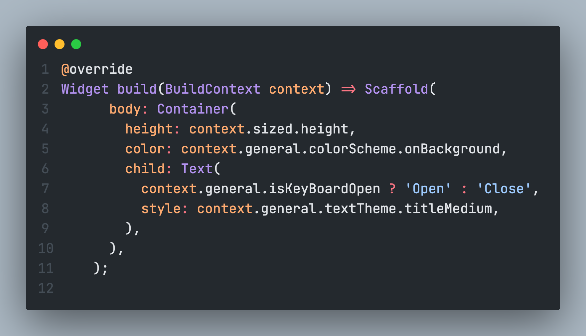
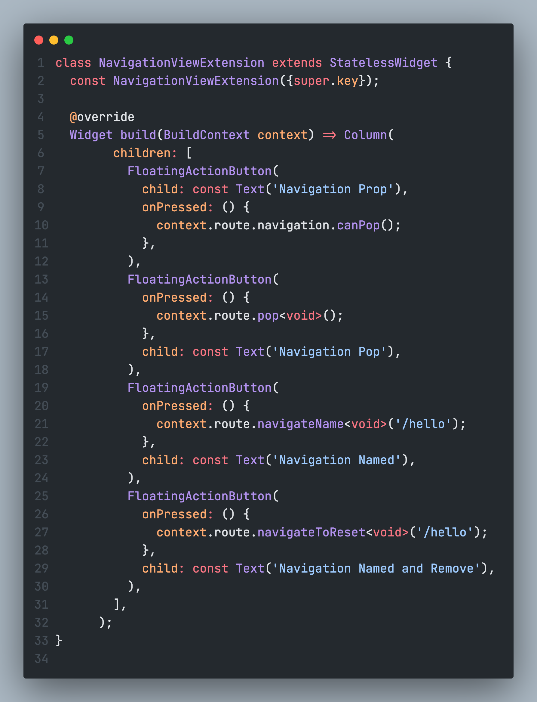
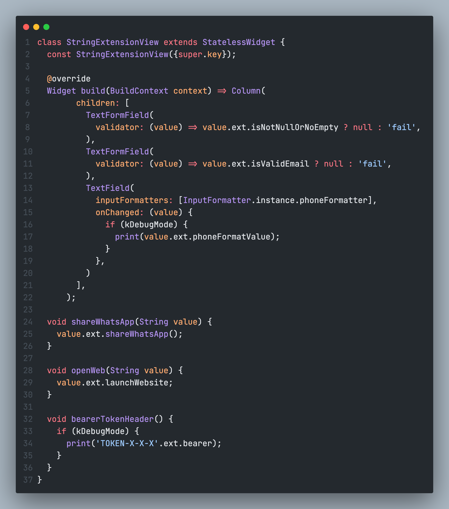
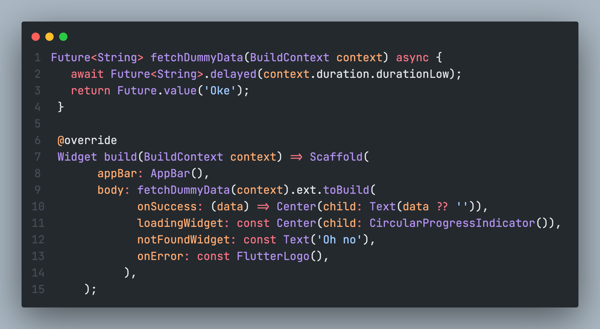
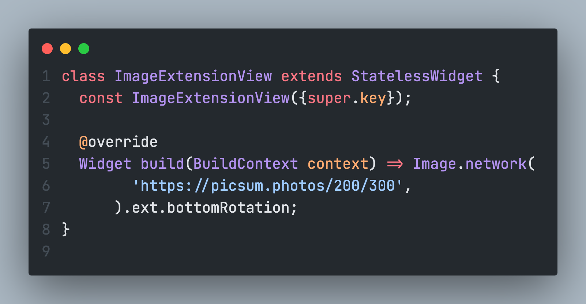
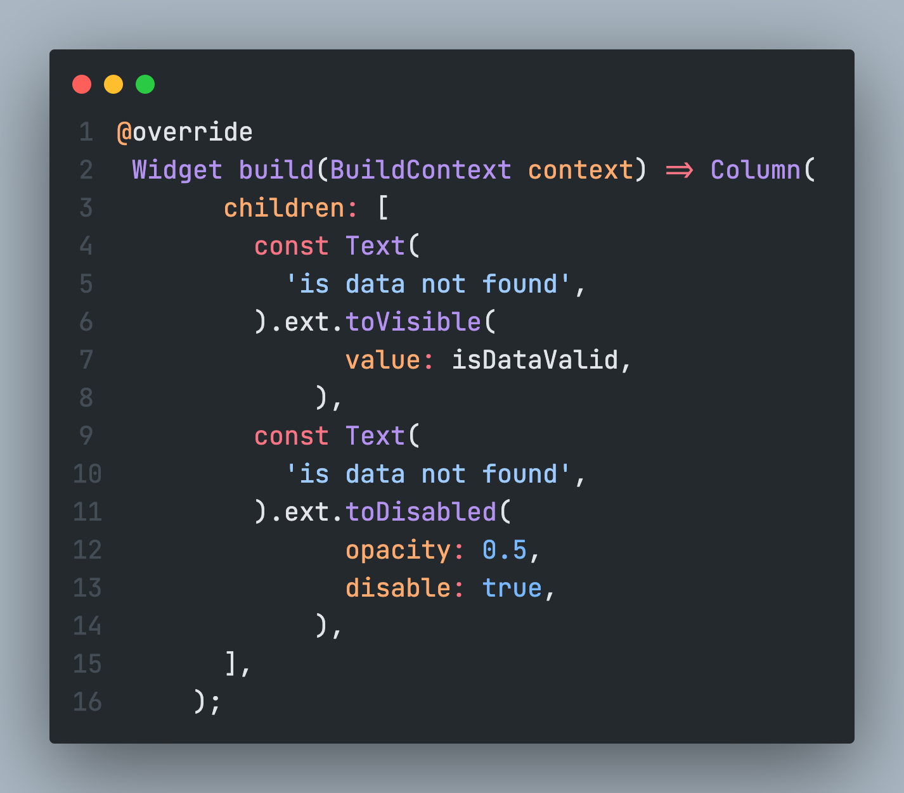

# kartal


My birth country is Kartal, so I created an extension to give born more power.

You should look at the example folder if you want to see an example using these extensions.

[](https://www.buymeacoffee.com/vb10)

## Context extension



You can use context.border to all.

### Border

- `lowRadius` (Radius)
- `normalRadius` (Radius)
- `highRadius` (Radius)
- `normalBorderRadius` (BorderRadius)
- `lowBorderRadius` (BorderRadius)
- `highBorderRadius` (BorderRadius)
- `roundedRectangleBorderLow` (RoundedRectangleBorder)
- `roundedRectangleAllBorderNormal` (RoundedRectangleBorder)
- `roundedRectangleBorderNormal` (RoundedRectangleBorder)
- `roundedRectangleBorderMedium` (RoundedRectangleBorder)
- `roundedRectangleBorderHigh` (RoundedRectangleBorder)

### Device

You can use context.device to all.

- `isSmallScreen` (bool)
- `isMediumScreen` (bool)
- `isLargeScreen` (bool)
- `isAndroidDevice` (bool)
- `isIOSDevice` (bool)
- `isWindowsDevice` (bool)
- `isLinuxDevice` (bool)
- `isMacOSDevice` (bool)

### Duration

You can use context.duration to all.

- `durationLow` (Duration)
- `durationNormal` (Duration)
- `durationSlow` (Duration)

### General

You can use context.general to all

- `mediaQuery` (MediaQueryData)
- `appTheme` (ThemeData)
- `textTheme` (TextTheme)
- `primaryTextTheme` (TextTheme)
- `colorScheme` (ColorScheme)
- `randomColor` (MaterialColor)
- `isKeyBoardOpen` (bool)
- `keyboardPadding` (double)
- `appBrightness` (Brightness)
- `textScaleFactor` (double)

### Navigation



You can use context.route to all

- `navigation` (NavigatorState)
- `pop<T extends Object?>` (Future<bool>)
- `popWithRoot` (void)
- `navigateName<T extends Object?>` (Future<T?>)
- `navigateToReset<T extends Object?>` (Future<T?>)
- `navigateToPage<T extends Object?>` (Future<T?>)

### Padding

You can use context.padding to all

- `_lowValue` (double): 0.01 \* widget height
- `_normalValue` (double): 0.02 \* widget height
- `_mediumValue` (double): 0.04 \* widget height
- `_highValue` (double): 0.1 \* widget height
- `low` (EdgeInsets): EdgeInsets.all(\_lowValue)
- `normal` (EdgeInsets): EdgeInsets.all(\_normalValue)
- `medium` (EdgeInsets): EdgeInsets.all(\_mediumValue)
- `high` (EdgeInsets): EdgeInsets.all(\_highValue)
- `horizontalLow` (EdgeInsets): EdgeInsets.symmetric(horizontal: \_lowValue)
- `horizontalNormal` (EdgeInsets): EdgeInsets.symmetric(horizontal: \_normalValue)
- `horizontalMedium` (EdgeInsets): EdgeInsets.symmetric(horizontal: \_mediumValue)
- `horizontalHigh` (EdgeInsets): EdgeInsets.symmetric(horizontal: \_highValue)
- `verticalLow` (EdgeInsets): EdgeInsets.symmetric(vertical: \_lowValue)
- `verticalNormal` (EdgeInsets): EdgeInsets.symmetric(vertical: \_normalValue)
- `verticalMedium` (EdgeInsets): EdgeInsets.symmetric(vertical: \_mediumValue)
- `verticalHigh` (EdgeInsets): EdgeInsets.symmetric(vertical: \_highValue)
- `onlyLeftLow` (EdgeInsets): EdgeInsets.only(left: \_lowValue)
- `onlyLeftNormal` (EdgeInsets): EdgeInsets.only(left: \_normalValue)
- `onlyLeftMedium` (EdgeInsets): EdgeInsets.only(left: \_mediumValue)
- `onlyLeftHigh` (EdgeInsets): EdgeInsets.only(left: \_highValue)
- `onlyRightLow` (EdgeInsets): EdgeInsets.only(right: \_lowValue)
- `onlyRightNormal` (EdgeInsets): EdgeInsets.only(right: \_normalValue)
- `onlyRightMedium` (EdgeInsets): EdgeInsets.only(right: \_mediumValue)
- `onlyRightHigh` (EdgeInsets): EdgeInsets.only(right: \_highValue)
- `onlyBottomLow` (EdgeInsets): EdgeInsets.only(bottom: \_lowValue)
- `onlyBottomNormal` (EdgeInsets): EdgeInsets.only(bottom: \_normalValue)
- `onlyBottomMedium` (EdgeInsets): EdgeInsets.only(bottom: \_mediumValue)
- `onlyBottomHigh` (EdgeInsets): EdgeInsets.only(bottom: \_highValue)
- `onlyTopLow` (EdgeInsets): EdgeInsets.only(top: \_lowValue)
- `onlyTopNormal` (EdgeInsets): EdgeInsets.only(top: \_normalValue)
- `onlyTopMedium` (EdgeInsets): EdgeInsets.only(top: \_mediumValue)
- `onlyTopHigh` (EdgeInsets): EdgeInsets.only(top: \_highValue)

### Size

You can use context.sized to all

- `emptySizedWidthBoxLow` (Widget): Empty `SpaceSizedWidthBox` widget with a low width size of 0.01 times the height.
- `emptySizedWidthBoxLow3x` (Widget): Empty `SpaceSizedWidthBox` widget with a low width size of 0.03 times the height.
- `emptySizedWidthBoxNormal` (Widget): Empty `SpaceSizedWidthBox` widget with a normal width size of 0.05 times the height.
- `emptySizedWidthBoxHigh` (Widget): Empty `SpaceSizedWidthBox` widget with a high width size of 0.1 times the height.
- `emptySizedHeightBoxLow` (Widget): Empty `SpaceSizedHeightBox` widget with a low height size of 0.01 times the height.
- `emptySizedHeightBoxLow3x` (Widget): Empty `SpaceSizedHeightBox` widget with a low height size of 0.03 times the height.
- `emptySizedHeightBoxNormal` (Widget): Empty `SpaceSizedHeightBox` widget with a normal height size of 0.05 times the height.
- `emptySizedHeightBoxHigh` (Widget): Empty `SpaceSizedHeightBox` widget with a high height size of 0.1 times the height.
- `height` (double): Height of the current widget's `MediaQuery`.
- `width` (double): Width of the current widget's `MediaQuery`.
- `lowValue` (double): A value representing a low dimension, calculated as 0.01 times the current widget's height.
- `normalValue` (double): A value representing a normal dimension, calculated as 0.02 times the current widget's height.
- `mediumValue` (double): A value representing a medium dimension, calculated as 0.04 times the current widget's height.
- `highValue` (double): A value representing a high dimension, calculated as 0.1 times the current widget's height.
- `dynamicWidth(double val)` (double): Calculates and returns a dynamic width value based on the provided `val` and the current widget's width.
- `dynamicHeight(double val)` (double): Calculates and returns a dynamic height value based on the provided `val` and the current widget's height.

## String extension



You can use 'any string '.ext to all

- `lineLength` (int): Returns the number of lines in the string.
- `color` (Color): Returns a Color object parsed from the string.
- `toCapitalized()` (String): Converts the first letter of the string to a capital letter.
- `toTitleCase()` (String): Converts all letters of the string to title case.
- `colorCode` (int?): Returns the color code parsed from the string.
- `toColor` (Color): Returns a Color object from the color code.
- `isNullOrEmpty` (bool): Returns true if the string is null or empty.
- `isNotNullOrNoEmpty` (bool): Returns true if the string is not null and not empty.
- `isValidEmail` (bool): Checks if the string is a valid email address.
- `isValidPassword` (bool): Checks if the string is a valid password.
- `withoutSpecialCharacters` (String?): Removes all diacritics from the string.
- `phoneFormatValue` (String): Returns the value of the phone number without formatting characters.
- `timeFormatValue` (String): Formats the value of the string as a time.
- `timeOverlineFormatValue` (String): Unmasks the text for the time overline format.
- `randomImage` (String): Returns a URL for a random image.
- `randomSquareImage` (String): Returns a URL for a random square image.
- `customProfileImage` (String): Returns a URL for a custom profile image.
- `customHighProfileImage` (String): Returns a URL for a custom high-resolution profile image.
- `bearer` (Map<String, dynamic>): Returns a map with a bearer token.
- `launchEmail` (Future<bool>): Launches the email app with the email address.
- `launchPhone` (Future<bool>): Launches the phone app with the phone number.
- `launchWebsite` (Future<bool>): Launches the website with the string as the URL.
- `launchWebsiteCustom` (Future<bool>): Launches the website with custom configuration.
- `shareWhatsApp()` (Future<void>): Shares the string via WhatsApp.
- `shareMail(String title)` (Future<void>): Shares the string via email with a title.
- `share()` (Future<void>): Shares the string.
- `appName` (String): Returns the name of the app.
- `packageName` (String): Returns the package name of the app.
- `version` (String): Returns the version of the app.
- `buildNumber` (String): Returns the build number of the app.
- `deviceId` (Future<String>): Returns the unique device ID.

## File extension

You can use File().ext to all

- `fileType` (FileType): Returns the FileType of the file based on its MIME type.
- `isImageFile` (bool): Returns true if the file is of type FileType.IMAGE.
- `isVideoFile` (bool): Returns true if the file is of type FileType.VIDEO.
- `isAudioFile` (bool): Returns true if the file is of type FileType.AUDIO.
- `isTextFile` (bool): Returns true if the file is of type FileType.TEXT.

## Future extension



You can use Future().ext

- `toBuild` (Widget): Builds a widget based on the state of a future. It allows specifying different widgets for different states, such as loading, success, not found, and error.

  - `onSuccess` (required): Widget Function(T? data) - Specifies the widget to display when the future completes successfully. It receives the data from the future as a parameter.
  - `loadingWidget` (required): Widget - Specifies the widget to display while the future is loading or in an active state.
  - `notFoundWidget` (required): Widget - Specifies the widget to display when the future has no connection state.
  - `onError` (required): Widget - Specifies the widget to display when an error occurs during the future's execution.
  - `data` (optional): T? - The initial data to provide to the future builder.

## Image Extension



You can use Image().ext to all

- `rightRotation` (Widget): Returns a [RotationTransition] widget that applies a right rotation animation to the image.

- `upRotation` (Widget): Returns a [RotationTransition] widget that applies an up rotation animation to the image.

- `bottomRotation` (Widget): Returns a [RotationTransition] widget that applies a bottom rotation animation to the image.

- `leftRotation` (Widget): Returns a [RotationTransition] widget that applies a left rotation animation to the image.

## Key Extension

- `RenderBox? get rendererBox`

  - Returns the `RenderBox` associated with the current widget.
  - Return Type: `RenderBox?`

- `Offset? get offset`

  - Returns the global offset of the current widget.
  - Return Type: `Offset?`

- `double? get height`

  - Returns the height of the current widget.
  - Return Type: `double?`

- `void scrollToWidget({ScrollPositionAlignmentPolicy alignmentPolicy = ScrollPositionAlignmentPolicy.explicit})`
  - Scrolls to the current widget.
  - Parameters:
    - `alignmentPolicy` (optional): The alignment policy during scrolling. Default: `ScrollPositionAlignmentPolicy.explicit`.
  - Return Type: `void`

## Asset Reader

You can parse your asset file with generic way.

```dart
   final posts = await BundleDecoder('assets/placeholder.json')
        .crackBundle<Post, List<Post>>(model: Post());
```

## List Extension

You can use List.ext to all

- `bool get isNullOrEmpty`
- `bool get isNotNullOrEmpty`
- `int? indexOrNull(bool Function(T) search)`

## Widget extension



You can use Widget.ext

- `toVisible({bool value = true})`
- `toDisabled({bool? disable, double? opacity})`
- `get sliver`

## License

[](/LICENSE)

2020 created for @VB10

## Youtube Channel

[](https://www.youtube.com/watch?v=UCdUaAKTLJrPZFStzEJnpQAg)

## Contributors

<a href="https://github.com/vb10/kartal/graphs/contributors">
  
</a>

Made with [contrib.rocks](https://contrib.rocks).
